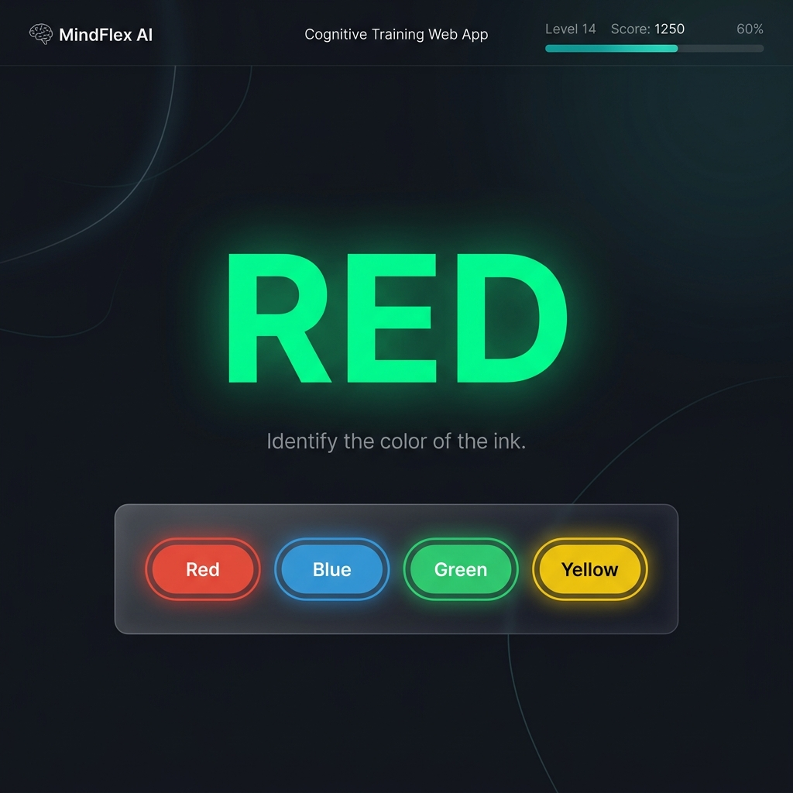

# Fokus

Короткие тренировки внимания и памяти.



Fokus — ежедневный ритуал на 5–12 минут: адаптивные упражнения по пяти областям (внимание, память, скорость, гибкость, логика), Fokus Index как единый показатель формы и честная аналитика без обещаний «прокачать IQ».

## Как запустить

Убедитесь, что у вас установлен Node.js.
```bash
npm install
npm run dev
```

Сборка для продакшена (PWA):
```bash
npm run build
npm run preview
```

## PWA

Fokus является прогрессивным веб-приложением (PWA). Оно кэширует ресурсы локально через \`ServiceWorker\` и может работать офлайн. Вы можете установить его на рабочий стол или на главный экран смартфона.

## Приватность

Прогресс, имя и ответы про сон/стресс хранятся в браузере на этом устройстве. Нет аккаунта и нет отправки профиля на сервер. В настройках есть инвентарь данных, экспорт без персональных полей и удаление. Подробности: [PRIVACY_G14.md](PRIVACY_G14.md).

## Как добавить упражнение

Каждое упражнение — это модуль, состоящий из 4 файлов:
1. \`manifest.ts\` (описание, иконка, домен)
2. \`engine.ts\` (чистая логика без DOM)
3. \`view.ts\` (отрисовка и взаимодействие)
4. \`index.ts\` (экспорт по контракту)

Контракт (\`src/exercises/contract.ts\`):
\`\`\`typescript
export interface ExerciseModule {
  manifest: { id: string; name: string; domain: Domain; instruction: string }
  render(el: HTMLElement, level: number, onEnd: (r: BlockResult) => void, isTimeUp: () => boolean): void | (() => void)
}
\`\`\`

Чтобы добавить игру:
1. Создайте папку в \`src/exercises/\`
2. Реализуйте логику и верните \`ExerciseModule\` в \`index.ts\` (не забудьте \`return cleanup\`, если есть интервалы или rAF).
3. Добавьте ваш модуль в \`src/exercises/registry.ts\` и иконку \`icon-<id>.svg\` в \`public/art/\`.
